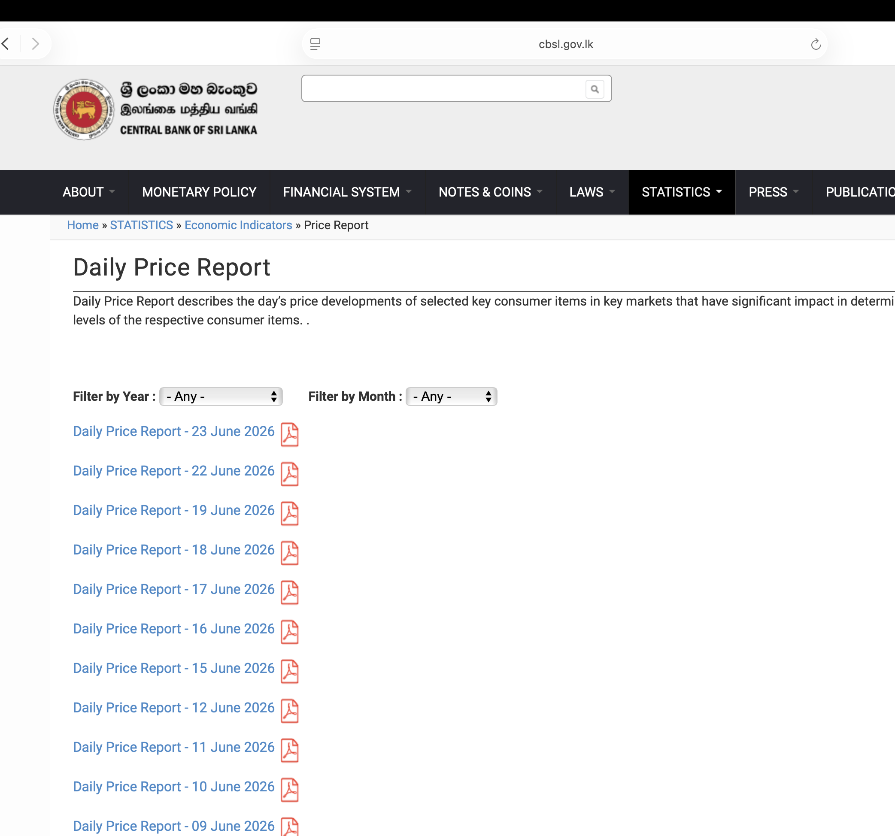
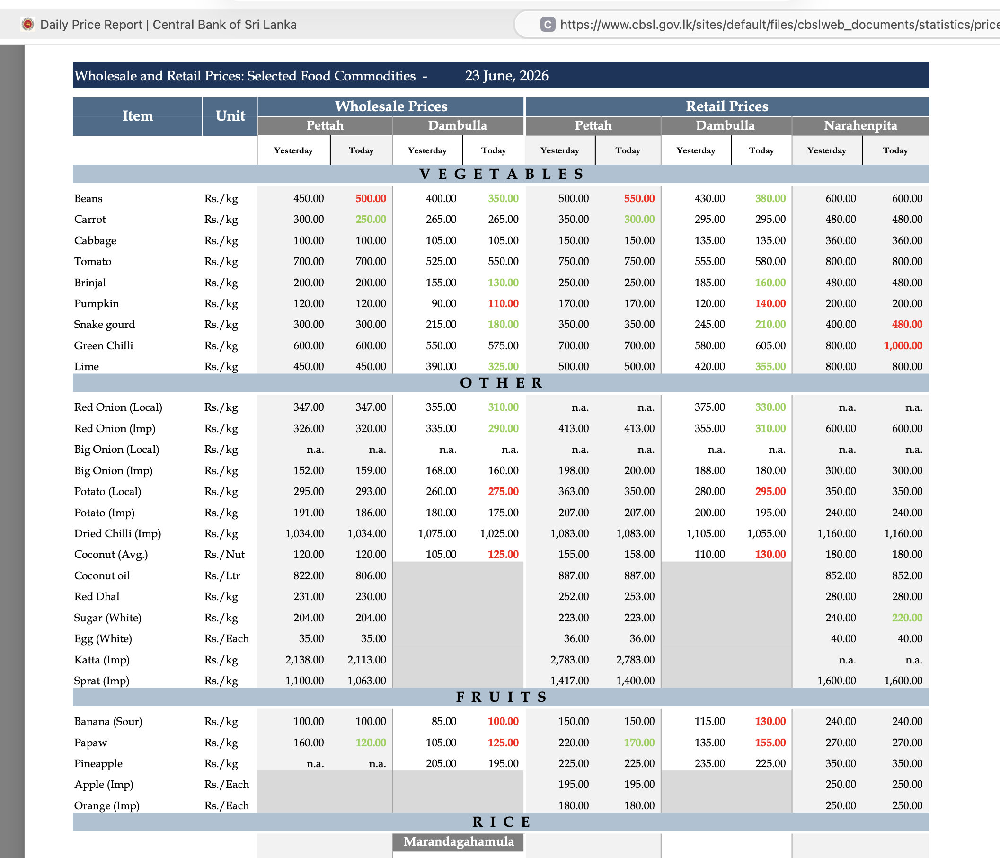
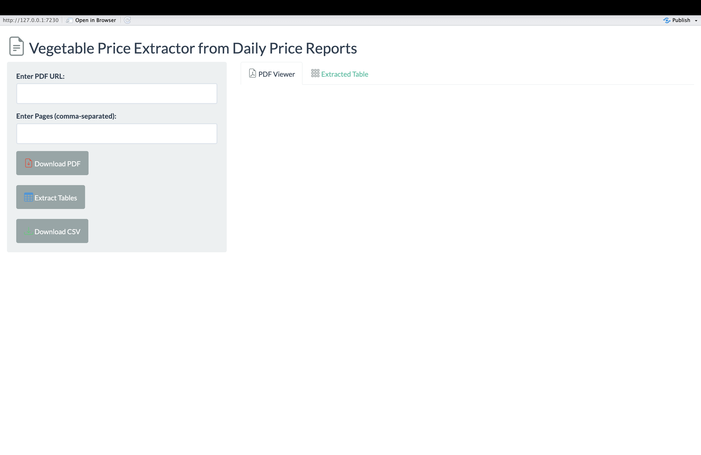
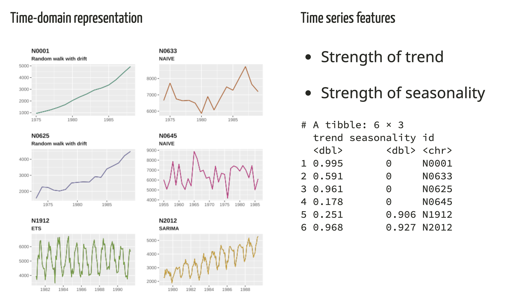
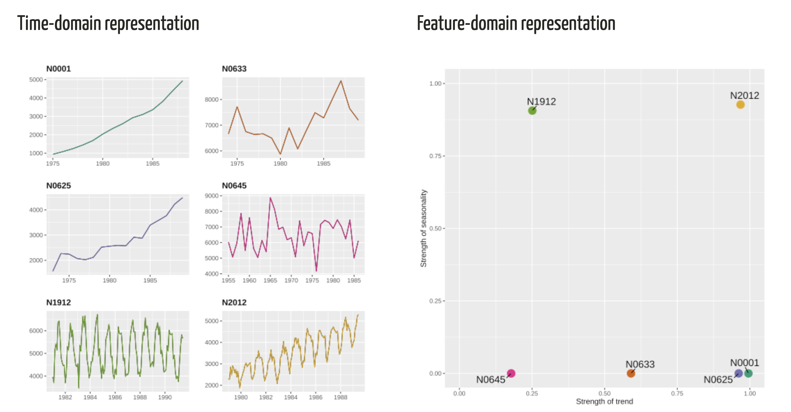

# {background-image="map2.png" background-size="cover"}

#

```{r}
library(dplyr)
library(tidyr)
library(purrr)
library(GGally)
library(tidytext)

```

:::: {.columns}

::: {.column width="60%"}

```{r}
#| echo: false
#| out.height: "100%"
#| fig.asp: 0.8
#| warnings: false
#| message: false
# install.packages("devtools")
#devtools::install_github("thiyangt/SriLanka")
library(tidyverse)
library(here)
library(SriLanka)
library(sf)
library(ggplot2)
library(dplyr)
library(plotly)
library(tidyverse)
veg_data <- data.frame(
  NAME_2 = c("Dambulla", "Colombo", "Kandy"),
  veg_index = c(90, 40, 70)
)

lka_adm2$veg_level <- factor(case_when(
  lka_adm2$NAME %in% c("Nuwara Eliya District","Badulla District","Matale District") ~ "High",
  lka_adm2$NAME %in% c("Kandy District","Kurunegala District","Kegalle District","Ratnapura District") ~ "Moderate",
  TRUE ~ "Low"
), levels = c("High", "Moderate", "Low"))
  
p1 <- ggplot(lka_adm2) +
  geom_sf(aes(fill = veg_level), color = "white") +
  scale_fill_manual(values = c("High" = "green3", Moderate = "#b2df8a", Low = "grey80")) +
  theme_minimal() +
  labs(fill = "Vegetable Production Level")
p1 
```
:::

::: {.column width="40%"}
### Vegetable Production Levels by District 
:::

::::

#

:::: {.columns}

::: {.column width="60%"}

```{r}
#| echo: false
#| out.height: "100%"
#| fig.asp: 0.8
# install.packages("devtools")
#devtools::install_github("thiyangt/SriLanka")

library(SriLanka)
library(sf)
library(ggplot2)
library(dplyr)
markets <- data.frame(
  name = c("Pettah \n Market", "Dambulla Market"),
  lon = c(79.8612, 80.6517),
  lat = c(6.9395, 7.8742)
)
p1  +
  geom_point(
    data = markets,
    aes(x = lon, y = lat),
    color = "red",
    size = 5
  ) +
  geom_text(
    data = markets,
    aes(x = lon, y = lat, label = name),
    nudge_y = 0.2,
    size = 5
  ) +
  theme_minimal()
```
:::

::: {.column width="40%"}
### Two Major Economic Centres

- Dambulla Market

    - Mainly a supply market.

- Pettah Market

    - Mainly a demand/retail market.
    
- These two markets serve as
key distribution hubs for vegetables across the country.


:::

::::

#

:::: {.columns}

::: {.column width="60%"}

```{r}
#| echo: false
#| out.height: "100%"
#| fig.asp: 0.8
# install.packages("devtools")
#devtools::install_github("thiyangt/SriLanka")

library(SriLanka)
library(sf)
library(ggplot2)
library(dplyr)
markets <- data.frame(
  name = c("Pettah \n Market", "Dambulla Market"),
  lon = c(79.8612, 80.6517),
  lat = c(6.9395, 7.8742)
)
p1  +
  geom_point(
    data = markets,
    aes(x = lon, y = lat),
    color = "red",
    size = 5
  ) +
  geom_text(
    data = markets,
    aes(x = lon, y = lat, label = name),
    nudge_y = 0.2,
    size = 5
  ) +
  theme_minimal()
```
:::

::: {.column width="40%"}

## Goal

To analyse and forecast retail and wholesale vegetable prices in Dambulla and Pettah.


:::

::::


#


:::: {.columns}

::: {.column width="60%"}

```{r}
#| echo: false
#| out.height: "100%"
#| fig.asp: 0.8
# install.packages("devtools")
#devtools::install_github("thiyangt/SriLanka")

library(SriLanka)
library(sf)
library(ggplot2)
library(dplyr)
markets <- data.frame(
  name = c("Pettah \n Market", "Dambulla Market"),
  lon = c(79.8612, 80.6517),
  lat = c(6.9395, 7.8742)
)
p1  +
  geom_point(
    data = markets,
    aes(x = lon, y = lat),
    color = "red",
    size = 5
  ) +
  geom_text(
    data = markets,
    aes(x = lon, y = lat, label = name),
    nudge_y = 0.2,
    size = 5
  ) +
  theme_minimal()
```
:::

::: {.column width="40%"}

## Goal

To analyse and forecast retail and wholesale vegetable prices in Dambulla and Pettah.

## Data 

Daily price reports published by the Central Bank of Sri Lanka (CBSL)


:::

::::

#

## Daily Price Reports Published by CBSL



## Daily Price Reports Published by CBSL


:::: {.columns}

::: {.column width="40%"}


:::

::: {.column width="60%"}




:::

::::

#


:::: {.columns}

::: {.column width="40%"}

### R package for Web Scrapping Data From Daily Price Reports


:::

::: {.column width="60%"}

```r
# install.packages("pak")
pak::pak("thiyangt/vegscraper")
vegscraper::run_app()
```


:::

::::


#


:::: {.columns}

::: {.column width="50%"}

### R Package for Tidy Data


:::

::: {.column width="50%"}


```r
install.packages("vegetablesSriLanka")
pak::pak("thiyangt/vegetablesSriLanka")
```

```{r}
#| echo: true
library(vegetablesSriLanka)
data("vegetables.srilanka")
vegetables.srilanka
```


:::

::::

#

## Vegetables Included in the Analysis


:::: {.columns}

::: {.column width="50%"}

- Beans
 
- Big Onion (Imp)

- Big Onion (Local)

- Brinjal

- Cabbage

- Carrot

- Green Chilli


:::

::: {.column width="50%"}


- Lime

- Potato (Imp)

- Potato (Local)

- Pumpkin

- Red onion (Imp)

- Red Onion (Local)

- Snake gourd

- Tomato


:::

::::

#

## 

```{r}


beans <- vegetables.srilanka |>
  filter(Item == "Beans")

p2 <- ggplot(beans, aes(x = Date, y = Price, col=Market)) +
  geom_line(linewidth = 0.7) +
#  geom_point(size = 0.6, alpha = 0.6) +
  facet_grid(Market ~ Type) +
  labs(
    title = "Beans Price Over Time",
    x = "Date",
    y = "Price"
  ) + scale_color_brewer(palette = "Dark2") +
  theme_minimal()
p2
```

#

```{r}
plot_cor <- function(item_name) {

  vegetables.srilanka |>
    filter(Item == item_name) |>
    mutate(series = paste(Market, Type, sep = "_")) |>
    select(Date, series, Price) |>
    pivot_wider(
      names_from = series,
      values_from = Price
    ) |>
    select(-Date) |>
    ggpairs(
     # upper = list(continuous = wrap("cor", size = 4)),
     # lower = "blank",
    #  diag = list(continuous = "blank")
    alpha=0.5) +
    ggtitle(item_name)
}

```

#


:::: {.columns}

::: {.column width="50%"}

```{r}
#| fig.height: 6
#| fig.width: 6
plot_cor("Beans")

```


:::

::: {.column width="50%"}

Within market wholesale–retail correlation is higher than cross-market wholesale–retail correlation.


:::

::::


## We have a total of 60 time series

- For each vegetable, we have four time series plots:

    - Dambulla–Retail
    - Dambulla–Wholesale
    - Pettah–Retail
    - Pettah–Wholesale

- With 15 vegetables, this results in 60 plots in total


##

```{r}
#| fig.width: 12
#| fig.height: 6
library(ggplot2)
library(dplyr)

p1 <-vegetables.srilanka |>
  mutate(
    Series = paste(Market, Type, sep = " - ")
  ) |>
  ggplot(
    aes(
      x = Date,
      y = Price,
      colour = Series,
      group = Series
    )
  ) +
  geom_line(linewidth = 0.5, alpha = 0.8) +
  facet_wrap(~Item, scales = "free_y") +
  labs(
    x = NULL,
    y = "Price (LKR/kg)",
    colour = NULL,
    title = "Vegetable Prices by Market and Type"
  ) +
  scale_color_brewer(palette = "Dark2") +
  theme_minimal(base_size = 12) +
  theme(
    legend.position = "bottom",
    strip.text = element_text(face = "bold")
  )
p1
```

#

```{r}
#| fig.width: 20
#| fig.height: 15
library(plotly)
ggplotly(p1)
```

##  Global View

- Global view focuses on the overall pattern or summary of the data.

- A global view considers the entire dataset at once.

    - What is the long-term pattern in the data?

    - Which market has the highest average price overall?

    - How do Pettah and Dambulla prices compare in general?


## Local View

- Local view focuses on fine details.

    - What happens to vegetable prices on Mondays?

    - Do prices change on weekends compared to weekdays?

    - Is there a price spike on a particular day of the week?
    
    - What happens to prices during festive weeks?

    - How do prices change immediately after a festival?

    - Is there a short-term spike during the Sinhala and Tamil New Year?

    - What is the price impact during a sudden supply shortage?
    
# Global View

# Time Series Features

- **Cognostics**: **Co**mputer-aided dia**gnostics** (John W. Tukey, 1985)

- Characteristics of time series

- Summary measures of time series


**Basic Principle**

- Transform a given time series $y=\{y_1, y_2, \cdots, y_n\}$ into a feature vector $F = (f_1(y), f_2(y), \cdots, f_p(y))'$. 

#

## Time Series Features

**strength of the trend** 

$$ F_T = \max \left(0,\; 1 - \frac{\operatorname{Var}(R_t)}{\operatorname{Var}(T_t + R_t)} \right)$$


**strength of seasonality** 


$$F_S = \max \left(0,\; 1 - \frac{\operatorname{Var}(R_t)}{\operatorname{Var}(S_t + R_t)} \right)$$

$\operatorname{Var}(R_t)$ - variance of the remainder component

$\operatorname{Var}(T_t + R_t)$ - variance after removing the seasonal component

$\operatorname{Var}(S_t + R_t)$ - variance of the detrended series

# 




#




#

### Global View: Feature-based Visualization

```{r}
features_train_pca <- read_csv(here("results", "features_train_pca.csv"))
library(kableExtra)
features_train_pca |>
  knitr::kable() |>
  kable_styling(font_size = 16)
```

#

```{r, echo=FALSE, message=FALSE, warning=FALSE, out.width="100%"}
library(ggplot2)
library(patchwork)


p1 <- ggplot(features_train_pca, aes(x = PC1, y = PC2, color = factor(Type))) +
  geom_point(size = 2) +
  scale_color_brewer(palette = "Set2") +
  theme(
    legend.position = "bottom",
    aspect.ratio = 1
  )+
  labs(title = "Type", x = "PC1", y = "PC2", color = "Type") 
p2 <- ggplot(features_train_pca, aes(x = PC1, y = PC2, color = factor(Market))) +
  geom_point(size = 2) +
  scale_color_manual(values = c("#E41A1C", "#377EB8"))+
  theme(
    legend.position = "bottom",
    aspect.ratio = 1
  ) +
  labs(title = "Market", x = "PC1", y = "PC2", color = "Type")

p1|p2
```
#

**Visualize Feature-space by Vegetable Type**

:::: {.columns}

::: {.column width="50%"}

```{r}
#| fig.width: 8
#| fig.height: 6
ggplot(features_train_pca, aes(x = PC1, y = PC2, color = factor(Item))) +
  geom_point(size = 3) +
  theme(
   legend.position = "right",
    aspect.ratio = 1
  ) +
  labs( x = "PC1", y = "PC2", color = "Type")

```


:::

::: {.column width="50%"}

```{r}
#| fig.width: 8
#| fig.height: 6
library(ggplot2)
library(gganimate)
library(dplyr)


features_train_pca_anim <- features_train_pca %>%
  mutate(id = row_number())

library(ggplot2)
library(gganimate)

p3 <- ggplot(features_train_pca,
             aes(PC1, PC2, color = Item)) +
  geom_point(size =4) +
  theme(
    aspect.ratio = 1,
    legend.position = "none"
  ) +
  labs(
    x = "PC1",
    y = "PC2",
    title = "Item: {closest_state}"
  ) +
  transition_states(
    Item,
    transition_length = 2,
    state_length = 1
  ) +
  ease_aes("linear")
p3
```


:::

::::

## Local View of Data: Beans

```{r}
library(tsibble)
library(dplyr)
library(dygraphs)
library(xts)
vegetables_long_tsibble <- vegetables.srilanka |>
  as_tsibble(key = c(Item, Type, Market),
    index = Date) 
veg_filled <- vegetables_long_tsibble |>
  group_by_key() |>
  fill_gaps() |>
  ungroup() |>
  as_tsibble() |>
  mutate(Year = year(Date))
# Filter for a single series
beans_dambulla <- veg_filled %>%
  filter(Item == "Beans", Type == "Retail", Market == "Dambulla") %>%
  select(Date, Price) %>%
  arrange(Date)  # Ensure chronological order

# Convert to xts
beans_xts <- xts(beans_dambulla$Price, order.by = beans_dambulla$Date)

# Draw dygraph
dygraph(beans_xts, main = "Beans Price in Dambulla (Retail)") %>%
  dyAxis("y", label = "Price (LKR)") %>%
  dyRangeSelector()  # Adds interactive date range
```

#

### Local View of Data: Beans-Retail-Dambulla

```{r }
p1 <- veg_filled |>
  filter(Year == 2025) |>
  filter(Item == "Beans", Type == "Retail", Market == "Dambulla") |>
  mutate(
    Week = isoweek(Date),
    Wday = factor(
      wday(Date, label = TRUE, abbr = TRUE, week_start = 1),
      levels = c("Mon", "Tue", "Wed", "Thu", "Fri", "Sat", "Sun")
    ),
    Count_bin = cut(
      Price,
      breaks = c(-Inf, 100, 300, 500, 700, 800, Inf),
      labels = c(
        "<100",
        "101–300",
        "301–500",
        "501–700",
        "701–800",
        ">801"
      ),
      right = FALSE
    )
  )
git_colours <- c(
  "#d73027",
  "#f46d43",
  "#fdae61",
  "#ffffbf",
  "#74add1",
  "#4575b4"
)

p1 <- p1 %>%
  arrange(Date) %>%
  group_by(Year) %>%
  mutate(
    Month_label = if_else(day(Date) == 1, 
                          as.character(month(Date, label = TRUE, abbr = TRUE)), 
                          NA_character_)
  ) %>%
  ungroup()
ggplot(p1, aes(Week, Wday)) +
  geom_tile(aes(fill = Count_bin),
            width = 0.9, height = 0.9,
            color = "white") +   # white outlines
  geom_text(aes(x = Week, y = 8, label = Month_label),
            na.rm = TRUE, fontface = "bold", size = 3) +
  scale_fill_manual(values = git_colours, drop = FALSE, name = "Daily arrivals") +
  facet_wrap(~ Year, ncol = 1) +
  scale_x_continuous(expand = c(0, 0)) +
  scale_y_discrete(limits = c("Mon","Tue","Wed","Thu","Fri","Sat","Sun")) +
  labs(
  #  title = "Daily Tourist Arrivals (GitHub-style Calendar Heatmap)",
    x = NULL,
    y = NULL
  ) +
  theme_minimal() +
  theme(
    panel.grid = element_blank(),
    axis.ticks = element_blank(),
    strip.text = element_text(face = "bold")
   # legend.position = "bottom"
  )
```

## Local View of Data

[https://thiyangt.github.io/vegetableBook/](https://thiyangt.github.io/vegetableBook/)

#


#
## Benchmark Approaches

- Naive

- Snaive

- SARIMA

- ETS

- STL-ETS: STL decomposition is applied to separate trend and seasonal components. Then, ETS is applied to the seasonally adjusted series (original series minus seasonal component) to forecast the underlying trend.

- STL-ARIMA: STL decomposition is applied to separate trend and seasonal components. Then, ARIMA is applied to the seasonally adjusted series (original series minus seasonal component) to forecast the underlying trend.

# Our Approach

A single model for forecasting all series offers several advantages:

 - Easier maintenance — only one model needs to be trained, monitored, and updated.
 
 - Cross-learning across vegetables — the model can learn common patterns shared among different vegetables, improving forecasting performance.

- Less preprocessing effort — a unified workflow reduces the need for series-specific feature engineering and model tuning.

## Retrieval-Augmented Feature-Based Random Forest (RAF-RF)

- Random Forest algorithm

- Feature-based forecasting

- Retrieved recent data


# Feature-based Forecasting

## 

:::::: columns
::: {.column width="50%"}
**Time features**

- Day, Year, Month, Week

**Lag features**

- lag7, lag14, lag30, lag365

**PCA features**

- First two PCs computed from lag features

**Compute past 30 window values**

- Past 30 window values
:::

::: {.column width="5%"}
:::

::: {.column width="40%"}
**Features based on past 30 window values**

- Minimum, maximum, median, Q1, Q3, Standarad Deviation

**Fourier terms**

- `sin_week = sin(2 * pi * t / 7)`, `cos_week = cos(2 * pi * t / 7)`, `sin_year = sin(2 * pi * t / 365)`, `cos_year = cos(2 * pi * t / 365)`
:::
::::::

## Retrieved Recent Data

- The 30 features corresponding to the past 30 time-window values are duplicated in the model (i.e., lag1, lag2, ..., lag30).

- Reason: To give higher weight to these features in the model.

- By doing so, we aim to signal to the model that recent observations carry more importance.


#


:::: {.columns}

::: {.column width="50%"}

### R Package for Feature Engineering


:::

::: {.column width="50%"}


```r
pak::pak("thiyangt/vegcast")
```

```{r}
#| echo: true
library(vegcast)
data("veg_sample")
time_features(veg_sample)
```


:::

::::


# Forecast Accuracy 

## Retail-Dambulla: MAPE

```{r, warning=FALSE, message=FALSE}
library(readr)
library(tidyverse)
library(Metrics)
accuracy_arima <- read_csv("ARIMA/accuracy_arima.csv")
accuracy_ets <- read_csv("ETS/accuracy_ets.csv")
accuracy_naive <- read_csv("NAIVE/accuracy_naive.csv")
accuracy_snaive <- read_csv("SNAIVE/accuracy_snaive.csv")
accuracy_stlarima <- read_csv("STL_ARIMA/accuracy_stlarima.csv")
accuracy_stlets <- read_csv("STL_ETS/accuracy_stlets.csv")
error_rf <- read_csv("results/mean_errors_rf1.csv")
error_nodup <- read_csv("results/mean_errors_rf2.csv")
mean_errors_rf <- error_rf |>
  group_by(Item, Type, Market) %>%
  summarise(
    mean_RMSE = mean(mean_RMSE, na.rm = TRUE),
    mean_MAE  = mean(mean_MAE, na.rm = TRUE),
    mean_MAPE = mean(mean_MAPE, na.rm = TRUE)
  )

mean_errors_rf2 <- error_nodup |>
  group_by(Item, Type, Market) %>%
  summarise(
    mean_RMSE = mean(mean_RMSE, na.rm = TRUE),
    mean_MAE  = mean(mean_MAE, na.rm = TRUE),
    mean_MAPE = mean(mean_MAPE, na.rm = TRUE)
  )
all <- accuracy_arima |> rename(SARIMA = MAPE)
all$ETS <- accuracy_ets$MAPE
all$NAIVE <- accuracy_naive$MAPE
all$SNAIVE <- accuracy_snaive$MAPE
all$STLARIMA <- accuracy_stlarima$MAPE
all$STLETS <- accuracy_stlets$MAPE
all$RF <- mean_errors_rf2$mean_MAPE
all$RAFRF <- mean_errors_rf$mean_MAPE
all <- all |> select(Item, Type, Market, 
                     SARIMA,
                     ETS,
                     NAIVE,
                     SNAIVE,
                     STLARIMA,
                     STLETS, 
                     RF,
                     RAFRF)

```

```{r}
#| fig.height: 10

df_long <- all |>
  filter(Type == "Retail",
         Market == "Dambulla") |>
  pivot_longer(
    cols = c(SARIMA, ETS, NAIVE, SNAIVE, STLARIMA, STLETS, RF, RAFRF),
    names_to = "Model",
    values_to = "MAPE"
  ) |>
  mutate(
    Highlight = if_else(Model == "RAFRF", "RAFRF", "Other")
  )
```

```{r}
ggplot(
  df_long,
  aes(
    x = reorder_within(Model, -MAPE, Item),
    y = MAPE,
    fill = Highlight
  )
) +
  geom_col() +
  facet_wrap(~ Item, scales = "free_y") +
  scale_x_reordered() +
  scale_fill_manual(
    values = c("RAFRF" = "red", "Other" = "grey70")
  ) +
  coord_flip() +
  theme_minimal() +
  theme(
    legend.position = "none"
  ) +
  labs(
   # title = "Retail - Dambulla",
    x = NULL,
  #  y = "RMSE"
  )
```

## Wholesale-Dambulla: MAPE

```{r}
#| fig.height: 10

df_long <- all |>
  filter(Type == "Wholesale",
         Market == "Dambulla") |>
  pivot_longer(
    cols = c(SARIMA, ETS, NAIVE, SNAIVE, STLARIMA, STLETS, RF, RAFRF),
    names_to = "Model",
    values_to = "MAPE"
  ) |>
  mutate(
    Highlight = if_else(Model == "RAFRF", "RAFRF", "Other")
  )
```

```{r}
ggplot(
  df_long,
  aes(
    x = reorder_within(Model, -MAPE, Item),
    y = MAPE,
    fill = Highlight
  )
) +
  geom_col() +
  facet_wrap(~ Item, scales = "free_y") +
  scale_x_reordered() +
  scale_fill_manual(
    values = c("RAFRF" = "red", "Other" = "grey70")
  ) +
  coord_flip() +
  theme_minimal() +
  theme(
    legend.position = "none"
  ) +
  labs(
   # title = "Retail - Dambulla",
    x = NULL,
  #  y = "RMSE"
  )
```

## Retail-Pettah: MAPE

```{r}
#| fig.height: 10

df_long <- all |>
  filter(Type == "Retail",
         Market == "Pettah") |>
  pivot_longer(
    cols = c(SARIMA, ETS, NAIVE, SNAIVE, STLARIMA, STLETS, RF, RAFRF),
    names_to = "Model",
    values_to = "MAPE"
  ) |>
  mutate(
    Highlight = if_else(Model == "RAFRF", "RAFRF", "Other")
  )
```

```{r}
ggplot(
  df_long,
  aes(
    x = reorder_within(Model, -MAPE, Item),
    y = MAPE,
    fill = Highlight
  )
) +
  geom_col() +
  facet_wrap(~ Item, scales = "free_y") +
  scale_x_reordered() +
  scale_fill_manual(
    values = c("RAFRF" = "red", "Other" = "grey70")
  ) +
  coord_flip() +
  theme_minimal() +
  theme(
    legend.position = "none"
  ) +
  labs(
   # title = "Retail - Dambulla",
    x = NULL,
  #  y = "RMSE"
  )
```

## Wholesale-Pettah: MAPE

```{r}
#| fig.height: 10

df_long <- all |>
  filter(Type == "Wholesale",
         Market == "Pettah") |>
  pivot_longer(
    cols = c(SARIMA, ETS, NAIVE, SNAIVE, STLARIMA, STLETS, RF, RAFRF),
    names_to = "Model",
    values_to = "MAPE"
  ) |>
  mutate(
    Highlight = if_else(Model == "RAFRF", "RAFRF", "Other")
  )
```

```{r}
ggplot(
  df_long,
  aes(
    x = reorder_within(Model, -MAPE, Item),
    y = MAPE,
    fill = Highlight
  )
) +
  geom_col() +
  facet_wrap(~ Item, scales = "free_y") +
  scale_x_reordered() +
  scale_fill_manual(
    values = c("RAFRF" = "red", "Other" = "grey70")
  ) +
  coord_flip() +
  theme_minimal() +
  theme(
    legend.position = "none"
  ) +
  labs(
   # title = "Retail - Dambulla",
    x = NULL,
  #  y = "RMSE"
  )
```

## Best Method for Each Series

```{r}
library(dplyr)
library(tidyr)
library(knitr)

# Assuming your tibble is called all_fitted_rf

# Step 1: Pivot longer so all models are in one column
long_fitted <- all %>%
  pivot_longer(
    cols = SARIMA:RAFRF, 
    names_to = "Model", 
    values_to = "MAPE"
  )

# Step 2: For each Item, Type, Market, find the model with the lowest MAPE
best_models <- long_fitted %>%
  group_by(Item, Type, Market) %>%
  slice_min(MAPE, n = 1, with_ties = FALSE) %>%  # pick lowest MAPE
  ungroup()

# Step 3: Display nicely
#best_models |> as.data.frame()
```


```{r}
features_train_pca <- features_train_pca |>
  left_join(best_models, by =c("Item", "Type", "Market"))

p4 <- ggplot(features_train_pca, aes(x = PC1, y = PC2, color = Model)) +
  geom_point(size = 2) +
  scale_color_brewer(palette = "Set2") +
  theme(
    legend.position = "bottom",
    aspect.ratio = 1
  ) +
  labs( x = "PC1", y = "PC2", color = "Type") 

p4

```

#


```{r}
#| fig.width: 12
#| fig.height: 6
p1
```

## Variable Importance (Top 30)

```{r, echo=FALSE}
# Load later
model_rf <- readRDS("data/model_rf.rds")
# Extract variable importance
var_imp <- model_rf$variable.importance

# Sort from most to least important
var_imp_sorted <- sort(var_imp, decreasing = TRUE)
#var_imp_sorted
library(ggplot2)

# Convert to a tidy data frame
var_imp_df <- data.frame(
  Variable = names(var_imp_sorted),
  Importance = var_imp_sorted
)

top20 <- var_imp_df[1:30,]
ggplot(top20, aes(x = reorder(Variable, Importance), y = Importance)) +
  geom_col(fill = "steelblue") +
  coord_flip() + # flip for better readability
  labs(title = "Variable Importance (Permutation)",
       x = "Variable",
       y = "Importance")
```

## Variable Importance (Bottom 50)

```{r, echo=FALSE}
# Load later
model_rf <- readRDS("data/model_rf.rds")
# Extract variable importance
var_imp <- model_rf$variable.importance

# Sort from most to least important
var_imp_sorted <- sort(var_imp, decreasing = TRUE)
#var_imp_sorted
library(ggplot2)

# Convert to a tidy data frame
var_imp_df <- data.frame(
  Variable = names(var_imp_sorted),
  Importance = var_imp_sorted
)

top20 <- var_imp_df[50:90,]
ggplot(top20, aes(x = reorder(Variable, Importance), y = Importance)) +
  geom_col(fill = "steelblue") +
  coord_flip() + # flip for better readability
  labs(title = "Variable Importance (Permutation)",
       x = "Variable",
       y = "Importance")
```

## Variable Importance (Top 30): Model Without Duplicate Features

```{r, echo=FALSE}
# Load later
model_rf <- readRDS("data/model_rf2.rds")
# Extract variable importance
var_imp <- model_rf$variable.importance

# Sort from most to least important
var_imp_sorted <- sort(var_imp, decreasing = TRUE)
#var_imp_sorted
library(ggplot2)

# Convert to a tidy data frame
var_imp_df <- data.frame(
  Variable = names(var_imp_sorted),
  Importance = var_imp_sorted
)

top20 <- var_imp_df[1:30,]
ggplot(top20, aes(x = reorder(Variable, Importance), y = Importance)) +
  geom_col(fill = "steelblue") +
  coord_flip() + # flip for better readability
  labs(title = "Variable Importance (Permutation)",
       x = "Variable",
       y = "Importance")
```

# Final Insights

 - The proposed method performs well for most series, with only two exceptions.
 
 - The most important predictors are the early lag features and summary statistics from the 30-lag window.
 
- Qualitative variables contribute least in the global variable importance ranking.
 
- Future direction: Explore local interpretability methods to better understand individual predictions and model behavior at the observation level.


# Acknowledgement

This research was supported by the International Institute of Forecasters (IIF) through the Forecasting for Social Good (F4SG) Research Grant.

# 

**Slides and Codes**

Slides: https://thiyangt.github.io/isf2026/#/title-slide

Codes to reproduce results: https://github.com/thiyangt/vegforecastISF2026

**Contact**

Email: ttalagala@sjp.ac.lk
